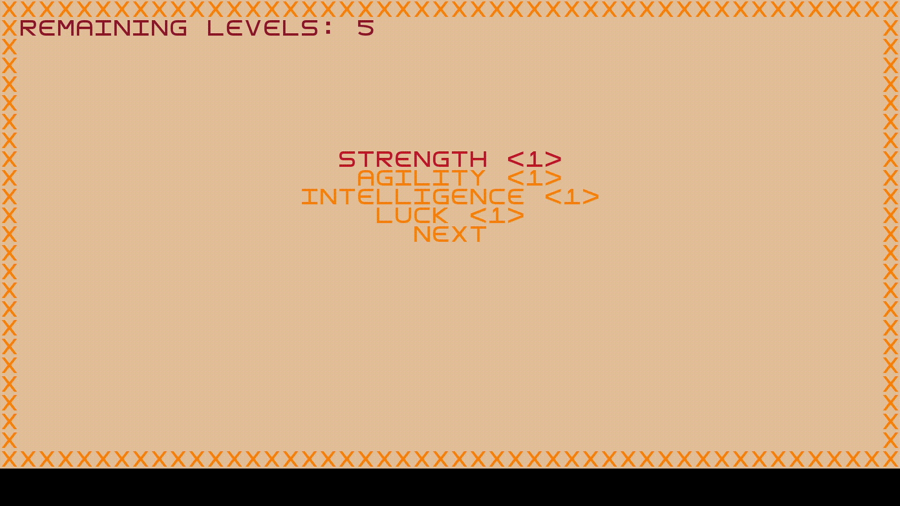

# LPOO: Fallout - a post pandemic RPG

# Introduction
O jogo que desenvolvemos em java assimila-se ao jogo original da série de jogos *Fallout*: um RPG clássico, onde o personagem principal, *Vault Boy*, luta contra inimigos num estilo de combate por turnos, explora arenas e ganha o jogo.

# Description
O *Vault Boy* surge num espaço repleto de monstros. Para progredir, deve combater e vencer os monstros, ou evitar a batalha, mantendo-se afastado dos inimigos. A batalha é em formato de combate por turnos. Em todas as rondas, é apresentado ao utilizador uma multitude de opções, com diferentes efeitos e que o ajudarão a vencer a batalha. A cada vitória, o *Vault Boy* ganha experiência e torna-se mais forte. De modo a vencer o jogo, o *Vault Boy* deve atingir a *Vault Door*, que se encontra na última arena.

# Comandos
 - **R**: Reset
 - **Setas do teclado**:
   - Exploração: andar
   - Batlha e Menus: permitem escolher as diferentes opções
 - **E**: Em modo exploração permite aceder ao menu onde são mostrados os dados sobre o personagem.
 - **Q**: Permite sair do jogo
 - **ESC**: Permite sair de alguns menus
 - **ENTER**: Permite selecionar opções em menus

# Small Demonstration

  

# Avisos
- Correr o executável do makelevels se os binários estiverem corrompidos

# Resultados
O programa desenvolvido está do agrado dos autores e corresponde a um sucesso, apesar de as ambições para o mesmo terem sido mais altas.

**GRADE:** ?

# Autores
Name | UP | Git Username |
-----|----|--------------|
Marcelo Couto | 201906086 | [marhcouto](https://github.com/marhcouto)
Francisco Oliveira | 201907361 | -
